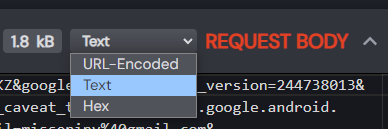

# 📷 Google Photos Uploader

This project is based on [google_photos_mobile_client](https://github.com/xob0t/google_photos_mobile_client) and allows you to **monitor a folder** (even SMB/NAS shares) and **automatically upload photos to Google Photos** without consuming storage space, using a lightweight Docker container.

---

## 🚀 Features

- ✅ Unlimited uploads in original quality  
- 🔁 Automatically skips already uploaded files  
- 📁 Works with local folders and SMB/NAS mounts  
- 🐳 Runs inside a minimal Docker container  

---

## 📦 Requirements

- Docker and Docker Compose installed on your host machine  
- A folder (or mounted SMB share) containing photos  
- An `AUTH_DATA` authentication key (see section below)  

---

## ⚙️ Docker Compose Configuration

Here's a sample `docker-compose.yml` configuration:

```yaml
services:
  gphotos-uploader:
    image: ciuse99/gphotos-uploader:latest
    container_name: gphotos-uploader
    restart: unless-stopped
    environment:
      - WATCHED_FOLDER=/data
      - AUTH_DATA=INSERT_YOUR_AUTH_DATA_HERE
    volumes:
      - INSERT_YOUR_PHOTO_FOLDER_HERE:/data
```

Replace `INSERT_YOUR_AUTH_DATA_HERE` with your real authentication string, and map your photo folder accordingly.

---

## ▶️ Getting Started

1. Open a terminal and navigate to the folder containing `docker-compose.yml`.
2. Start the container in the background:

```bash
docker-compose up -d
```

3. View live logs:

```bash
docker-compose logs -f
```

4. Stop the container:

```bash
docker-compose down
```

---

## 🔑 How to Get Your `AUTH_DATA`

You only need to do this **once** to retrieve your permanent key.

### ✅ Option 1 – ReVanced (No Root Required)

1. Install Google Photos ReVanced on your Android device:  
   - Install [GmsCore](https://github.com/ReVanced/GmsCore/releases)  
   - Install the patched APK from [here](https://github.com/j-hc/revanced-magisk-module/releases) or patch it yourself  
2. Connect your device to your PC via ADB.
3. Run the following in your terminal:

    **Windows:**
    ```cmd
    adb logcat | FINDSTR "auth%2Fphotos.native"
    ```

    **Linux/macOS:**
    ```bash
    adb logcat | grep "auth%2Fphotos.native"
    ```

4. If you've used ReVanced before, remove your Google Account from GmsCore.
5. Launch Google Photos ReVanced and log into your account.
6. You should see logs appear in your terminal.
7. Copy the full line starting from `androidId=` to the end. That’s your `AUTH_DATA`! 🎉

---

### 🛠 Option 2 – Official Google Photos App (Root Required)

<details>
  <summary><strong>Click to expand</strong></summary>

1. Use a rooted Android device or emulator (Android 9–13 recommended).
2. Connect your device to your PC via ADB.
3. Install [HTTP Toolkit](https://httptoolkit.com).
4. In HTTP Toolkit, go to **Intercept → Android Device via ADB**.
5. Apply the filter:

    ```text
    contains(https://www.googleapis.com/auth/photos.native)
    ```

    Or for older versions:

    ```text
    contains(www.googleapis.com%2Fauth%2Fplus.photos.readwrite)
    ```

6. Open Google Photos and log into your account.
7. Look for the captured request and copy the **request body** as plain text.  
   
8. That’s your `AUTH_DATA`! 🎉

</details>

---

## 🔄 Updating the Image

To update the image from Docker Hub and restart the container:

```bash
docker-compose pull
docker-compose up -d --force-recreate
```

---

## 💡 Notes

- You can change the monitored folder at any time by updating the volume bind and the `WATCHED_FOLDER` variable.
- If you encounter permission issues with SMB shares, ensure the container user has the correct access rights.
- Based on the open-source project [google_photos_mobile_client](https://github.com/xob0t/google_photos_mobile_client), with a simplified Docker integration.

---